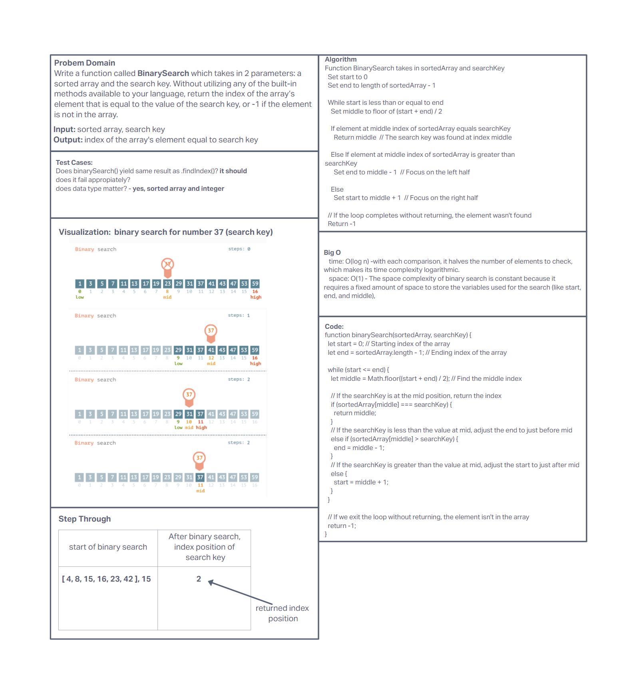

# Insert Shift Array

Write a function called insertShiftArray which takes in an array and a value to be added. Without utilizing any of the built-in methods available to your language, return an array with the new value added at the middle index.

## Whiteboard process

## Approach and Efficiency

The approach taken was similar to instruction which was defining problem domain, test cases, visualization, algorithm, big O, code, and finally step through.

**The Big O is:**

* time: O(log n) - with each comparison, it halves the number of elements to check, which makes its time complexity logarithmic.
* space: O(1) - The space complexity of binary search is constant because it requires a fixed amount of space to store the variables used for the search (like start, end, and middle),
