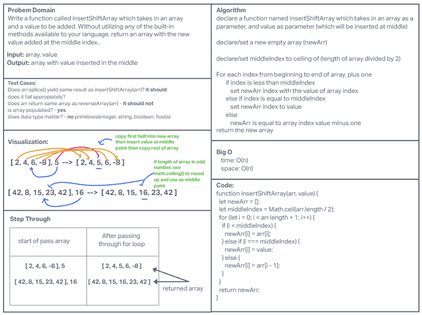

# Insert Shift Array

Write a function called insertShiftArray which takes in an array and a value to be added. Without utilizing any of the built-in methods available to your language, return an array with the new value added at the middle index.

## Whiteboard process

## Approach and Efficiency

The approach taken was similar to instruction which was defining problem domain, test cases, visualization, algorithm, big O, code, and finally step through.

**The Big O is:**

* time: O(n) - due to a single loop iterating over each element once.
* space: O(n) - because of the new array that stores n + 1 elements (n from the original array and one additional element).
