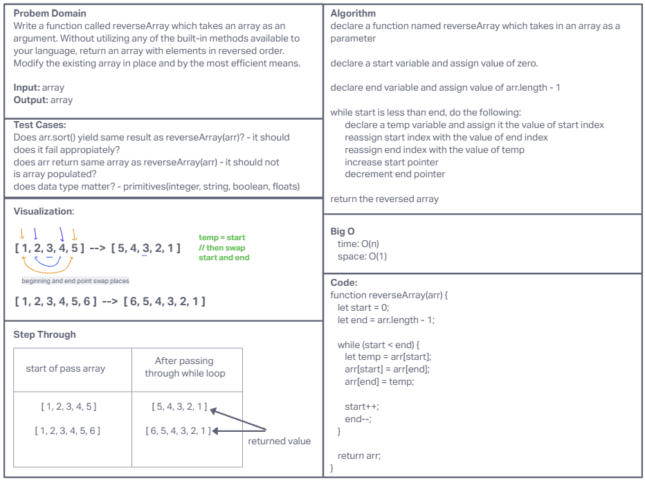

# Reverse an Array

Write a function called reverseArray which takes an array as an argument. Without utilizing any of the built-in methods available to your language, return an array with elements in reversed order.

## Whiteboard process

## Approach and Efficiency

I am inexperienced with whiteboarding at the moment.  The approach taken was similar to instruction which was defining problem domain, test cases, visualization, algorithm, big O, code, and finally step through.

**The Big O is:**

* time: O(n)
* space: O(1)
