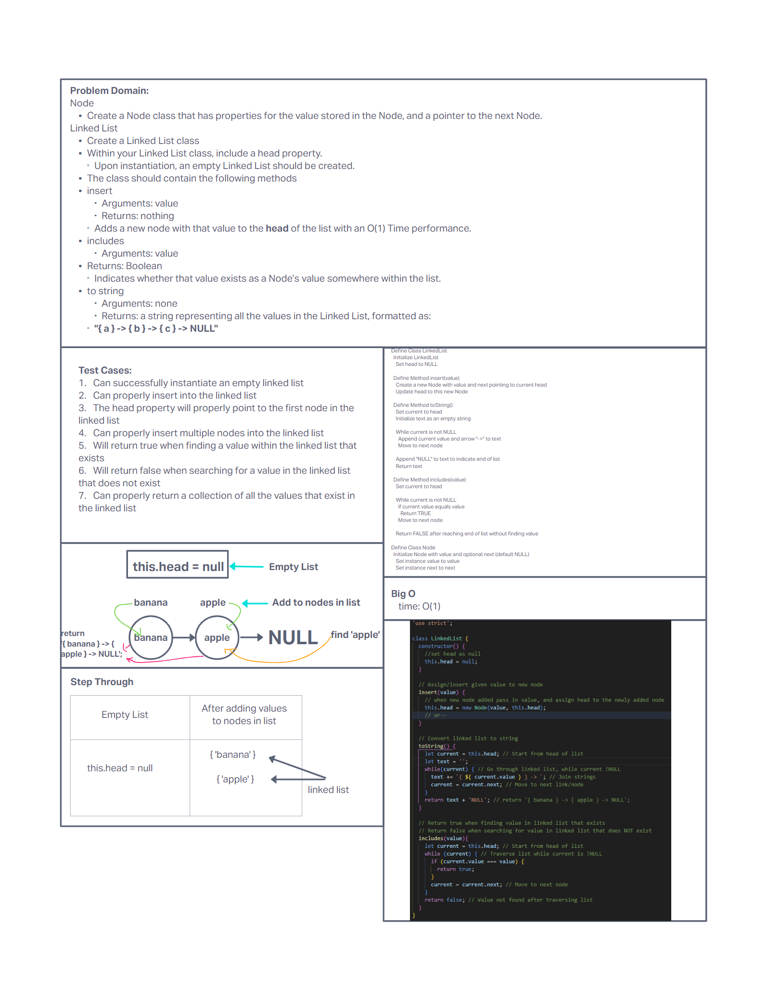

# Linked Lists

## Node

* Create a Node class that has properties for the value stored in the Node, and a pointer to the next Node.

## Linked List

* Create a Linked List class

* Within your Linked List class, include a head property.
  * Upon instantiation, an empty Linked List should be created.

* The class should contain the following methods
  * insert
    * Arguments: value
    * Returns: nothing
    * Adds a new node with that value to the head of the list with an O(1) Time performance.

  * includes
    * Arguments: value
    * Returns: Boolean
      * Indicates whether that value exists as a Node’s value somewhere within the list.

  * to string
    * Arguments: none
    * Returns: a string representing all the values in the Linked List, formatted as:
    * "{ a } -> { b } -> { c } -> NULL"

* Write the following methods for the Linked List class:

  * append
    * arguments: new value
    * adds a new node with the given value to the end of the list

  * insert before
    * arguments: value, new value
    * adds a new node with the given new value immediately before the first node that has the value specified

  * insert after
    * arguments: value, new value
    * adds a new node with the given new value immediately after the first node that has the value specified

## Whiteboard process

## Approach and Efficiency

The approach taken was similar to instruction which was defining problem domain, writing test first, coding to run the tests on, and refactoring if necessary.

### **The Big O is:**

### 1. `append(value)`

* **Time Complexity**: O(n)
  * **Why**: In the worst-case scenario, you have to traverse the entire list to find the last node. The time it takes to perform this operation grows linearly with the number of nodes in the list, hence O(n), where `n` is the number of nodes.
* **Space Complexity**: O(1)
  * **Why**: You're only creating one new node regardless of the size of the input list. The space used does not grow with the size of the input list.

### 2. `insertBefore(targetValue, newValue)`

* **Time Complexity**: O(n)
  * **Why**: In the worst case, you might need to traverse almost the entire list to find the target value before which the new node will be inserted. The time complexity is O(n) because the operation scales linearly with the number of nodes in the list.
* **Space Complexity**: O(1)
  * **Why**: Similar to `append`, this operation creates a single new node, so the space complexity is constant, independent of the input list size.

### 3. `insertAfter(targetValue, newValue)`

* **Time Complexity**: O(n)
  * **Why**: You may need to traverse the list to find the target node after which to insert the new node. Like `insertBefore`, this operation's time complexity is linear with the list's length.
* **Space Complexity**: O(1)
  * **Why**: Regardless of the list's size, this operation also only creates one new node, maintaining a constant space complexity.
