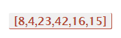
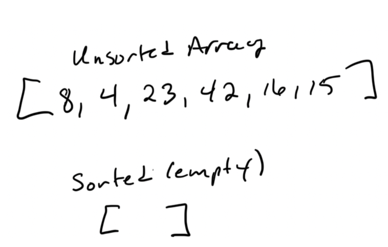
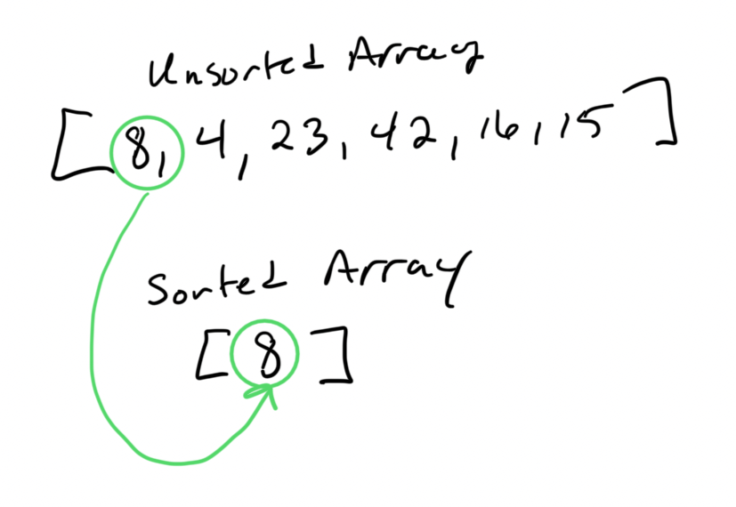
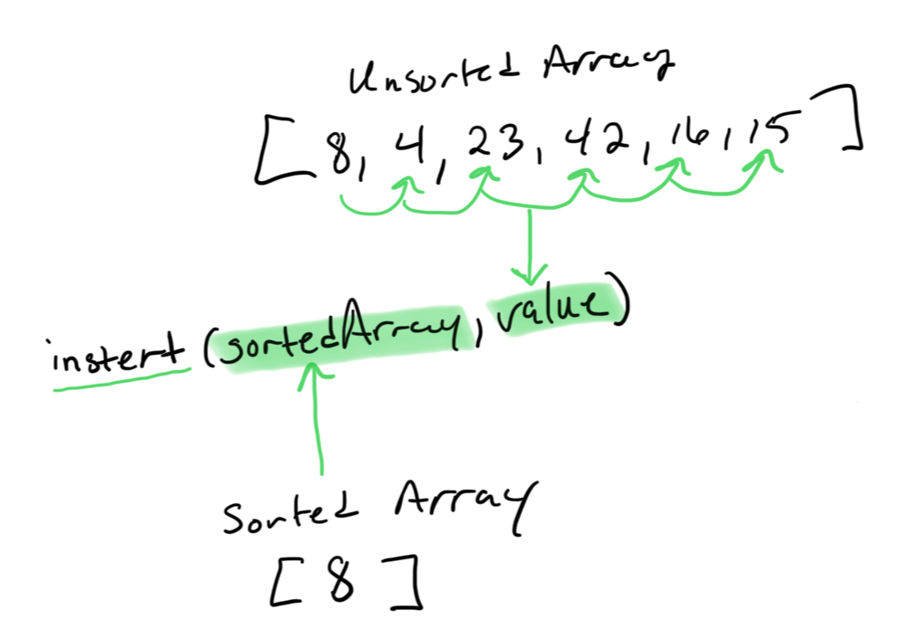
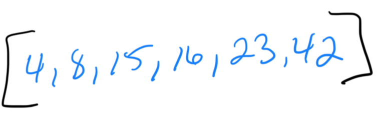
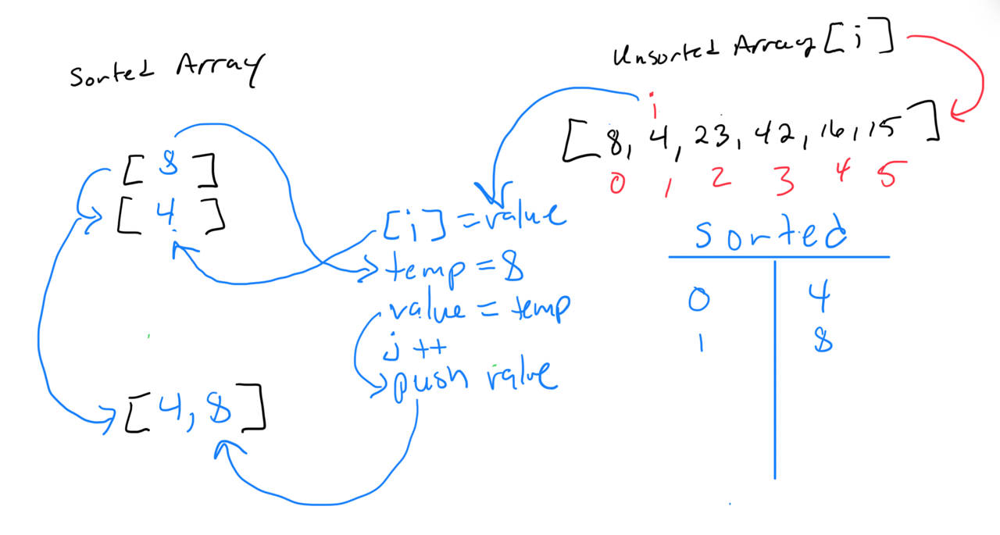
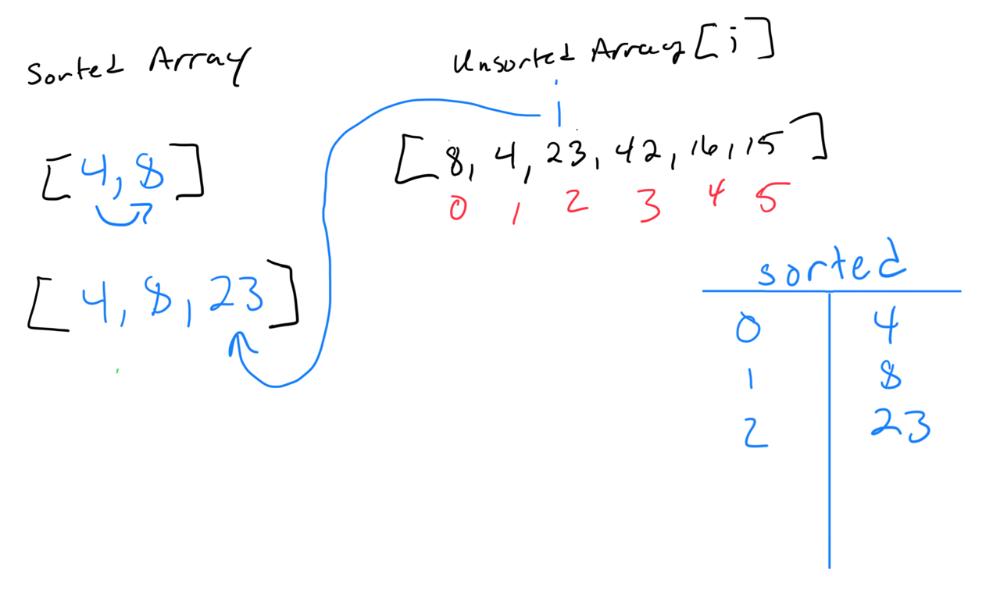
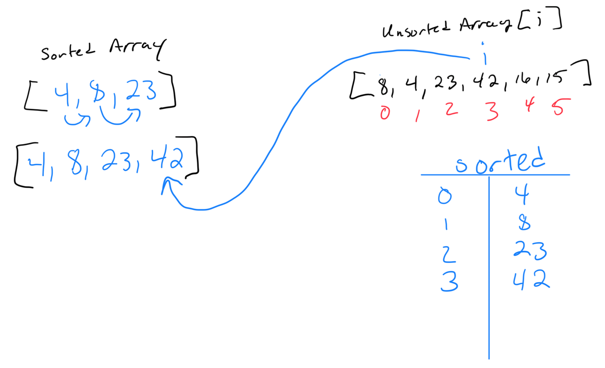
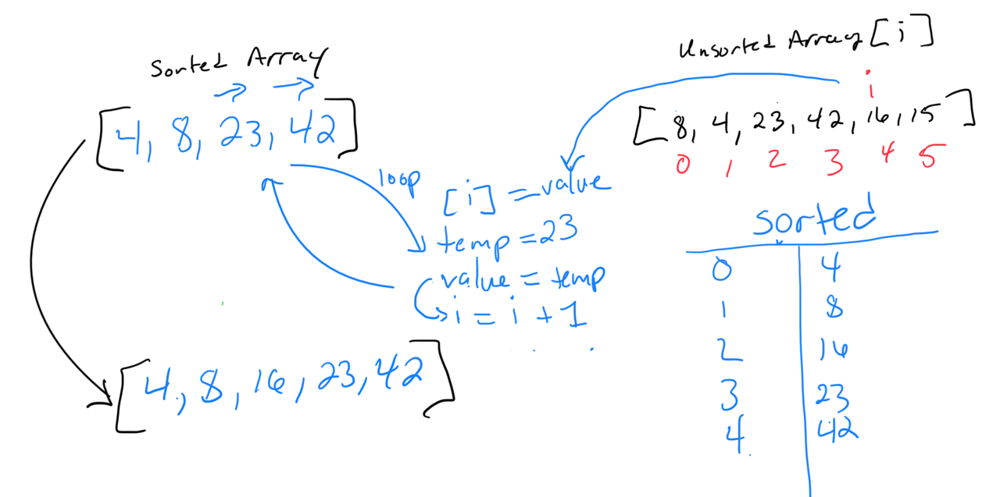
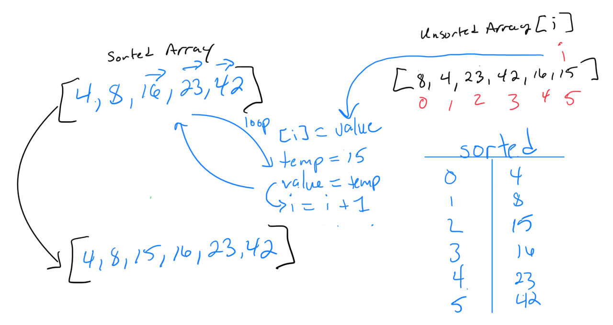

# Insertion Sort

## Objective

Review the pseudocode below, then trace the algorithm by stepping through the process with the provided sample array. Document explanation by creating a blog article that shows the step-by-step output after each iteration through some sort of visual.

Once done with article, code a working, tested implementation of Insertion Sort based on pseudocode provided.

## Pseudocode

```javascript
InsertionSort(int[] input)
  LET sorted = New Empty Array
  sorted[0] = input[0]
  FOR i from 1 up to input.length
    Insert(sorted, input[i])
  return sorted

Insert(int[] sorted, int value)
  initialize i to 0
  WHILE value > sorted[i]
    set i to i + 1
  WHILE i < sorted.length
    set temp to sorted[i]
    set sorted[i] to value
    set value to temp
    set i to i + 1
  append value to sorted

```

## Explanation

In the above pseudocode there are two functions.

**insertionSort Function**
The insertionSort function sorts an entire array by building a new sorted array from the original unsorted array. It starts by copying the first element from the input array to the sorted array. Then, for each remaining element, it uses the insert function to place the element in the correct position within the sorted array, ultimately returning a fully sorted array

**insert Function**
The insert function finds the correct position for a value in a sorted array and inserts it there by shifting other elements to the right. It starts at the beginning of the array and moves through it until it finds where the value should go. Then it moves each element one position to the right to make space and adds the value in its correct place.

## Trace - insertionSort()

### Sample Array



### Initialization


The insertionSort function starts by creating an empty array called sorted to hold the sorted values. It takes an unsorted array as input and prepares to sort it. This step sets the stage for sorting by providing a place to store the ordered elements.

### First Element Placing


The function takes the first element of the unsorted array and places it as the first element of the sorted array. This initial step ensures that there is a starting point for the sorting process. With one element in the sorted array, it can now begin the sorting process for the rest of the elements.

### Iterative Insertion


The function iterates through the unsorted array, starting from the second element. For each element, it calls the insert function to place it in the correct position within the sorted array. This process continues until all elements from the unsorted array are inserted into the sorted array, resulting in a fully sorted array.

### Final Result


After iterating through all elements and inserting them into the sorted array, the function returns the sorted array. This final step provides the fully sorted array as the output of the insertionSort function. The unsorted array has now been transformed into a sorted array through the insertion sort algorithm.

## Trace - insert()

### Phase 1: Initialization

The insert function begins by setting an index variable i to 0. This variable will be used to traverse through the sortedArr to find the correct position for the new value. This step prepares the function to start at the beginning of the sorted array.

### Phase 2: Find Insertion Point

The function uses a while loop to find the correct position for the value by comparing it to the elements in sortedArr. It increments i as long as value is greater than the current element at sortedArr[i]. This loop ensures that i stops at the position where value should be inserted.

### Phase 3: Shift Elements

Once the correct position is found, the function uses another while loop to shift elements to the right to make space for the new value. It temporarily stores the current element in temp, assigns value to the current position, then updates value to temp and increments i. This loop continues until all elements have been shifted to the right.

### Phase 4: Insert Remaining Value

After shifting elements, the function appends the remaining value to the end of the sortedArr using the push method. This ensures that the last value, which has been shifted out of place, is correctly placed at the end of the array. The sorted array is now updated with the new value in its correct position.

### First Pass (Insert 4 into [8]):



* Initial sorted array: [8]
* Find position: 4 is less than 8, so insert at the beginning.
* Updated sorted array: [4, 8]

### Second Pass (Insert 23 into [4, 8]):



* Initial sorted array: [4, 8]
* Find position: 23 is greater than 4 and 8, so insert at the end.
* Updated sorted array: [4, 8, 23]

### Third Pass (Insert 42 into [4, 8, 23]):



* Initial sorted array: [4, 8, 23]
* Find position: 42 is greater than 4, 8, and 23, so insert at the end.
* Updated sorted array: [4, 8, 23, 42]

### Fourth Pass (Insert 16 into [4, 8, 23, 42]):



* Initial sorted array: [4, 8, 23, 42]
* Find position: 16 is greater than 4 and 8 but less than 23.
* Shift elements and insert 16.
* Updated sorted array: [4, 8, 16, 23, 42]

### Fifth Pass (Insert 15 into [4, 8, 16, 23, 42]):



* Initial sorted array: [4, 8, 16, 23, 42]
* Find position: 15 is greater than 4 and 8 but less than 16.
* Shift elements and insert 15.
* Updated sorted array: [4, 8, 15, 16, 23, 42]

### Sorted array returned


## Efficiency

### Time Complexity - O(n^2)

* Outer Loop: The insertionSort function iterates over each element of the input array once, so this loop runs n times.

* Inner Operations: For each element, the insert function potentially shifts elements in the sorted array. In the worst case, inserting an element might involve shifting all previously sorted elements (e.g., inserting the smallest element into a sorted array of length 𝑘 requires k shifts).

### Space Complexity - O(n)

* Sorted Array: The insertionSort function creates a new array sorted to store the sorted elements. The size of this array grows with the input array, resulting in a space complexity of 𝑂(𝑛).

* In-place Operations: The insert function modifies the sorted array in place and does not require additional space proportional to the input size.
