# Merge Sort

## Objective

Review the pseudocode below, then trace the algorithm by stepping through the process with the provided sample array. Document explanation by creating a blog article that shows the step-by-step output after each iteration through some sort of visual.

Once done with article, code a working, tested implementation of Merge Sort based on the pseudocode provided.

## Pseudocode

```javascript
ALGORITHM Mergesort(arr)
  DECLARE n <-- arr.length

  if n > 1
    DECLARE mid <-- n/2
    DECLARE left <-- arr[0...mid]
    DECLARE right <-- arr[mid...n]
    // sort the left side
    Mergesort(left)
    // sort the right side
    Mergesort(right)
    // merge the sorted left and right sides together
    Merge(left, right, arr)

ALGORITHM Merge(left, right, arr)
  DECLARE i <-- 0
  DECLARE j <-- 0
  DECLARE k <-- 0

  while i < left.length && j < right.length
    if left[i] <= right[j]
        arr[k] <-- left[i]
        i <-- i + 1
    else
        arr[k] <-- right[j]
        j <-- j + 1

    k <-- k + 1

  if i = left.length
    set remaining entries in arr to remaining values in right
  else
    set remaining entries in arr to remaining values in left
```

## Explanation

In the above pseudocode there are two functions.

**mergeSort Function**
The mergeSort function recursively divides the array into smaller sub-arrays until each sub-array has only one element. At this point, each sub-array is considered sorted because a single element is trivially sorted.

**insert Function**
The merge function takes two sorted sub-arrays and merges them into a single sorted array. This is where the actual sorting takes place.

## Trace

### Sample Array

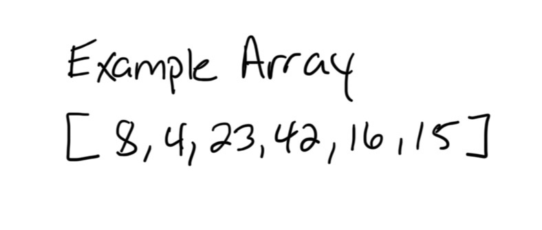

### Initial Call `mergeSort([8,4,23,42,16,15])`

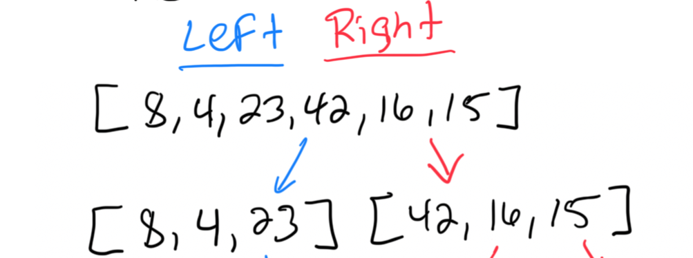

The array is split into [8, 4, 23] and [42, 16, 15].

### Left Half: `mergeSort(8, 4, 23)`

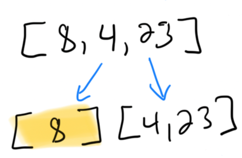

This is split into [8] and [4, 23].

### Right Half of Left Half: `mergeSort([4, 23])`

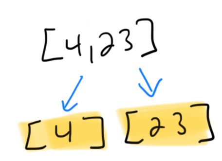

This is split into [4] and [23].

### Merge Step: `merge([4], [23], [4, 23])`

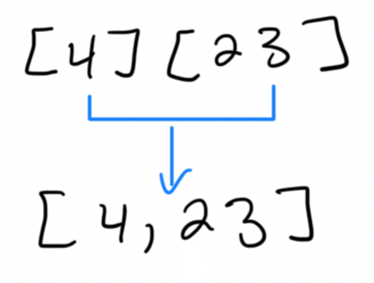

[4] and [23] are merged to form [4, 23].

### Merge Step: `merge([8], [4, 23], [8, 4, 23])`

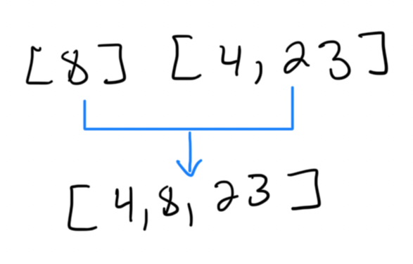

[8] and [4, 23] are merged to form [4, 8, 23].

### Right Half: `mergeSort([42, 16, 15])`

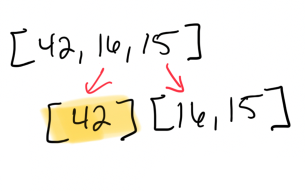

This is split into [42] and [16, 15].

### Right Half of Right Half: `mergeSort([16, 15])`

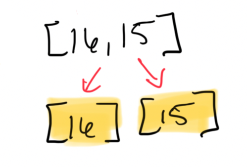

This is split into [16] and [15].

### Merge Step: `merge([16], [15], [16,15])`

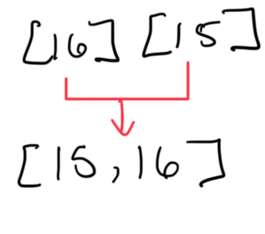

[16] and [15] are merged to form [15, 16].

### Merge Step: `merge([42], [15, 16], [42, 16, 15])`

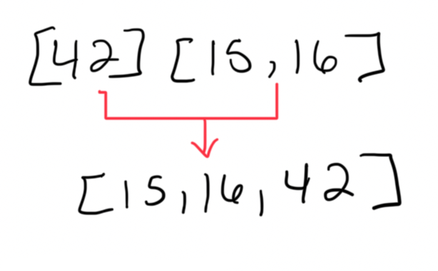

[42] and [15, 16] are merged to form [15, 16, 42].

### Final Merge: `merge([4, 8, 23], [15, 16, 42], [8, 4, 23, 42, 16, 15])`

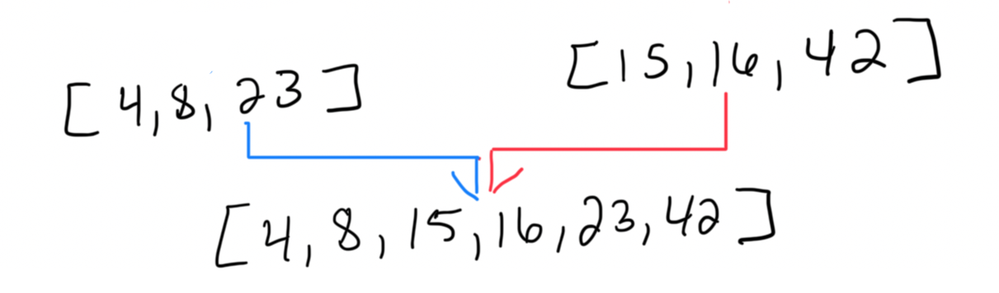

[4, 8, 23] and [15, 16, 42] are merged to form [4, 8, 15, 16, 23, 42].

## Full Overview Diagram

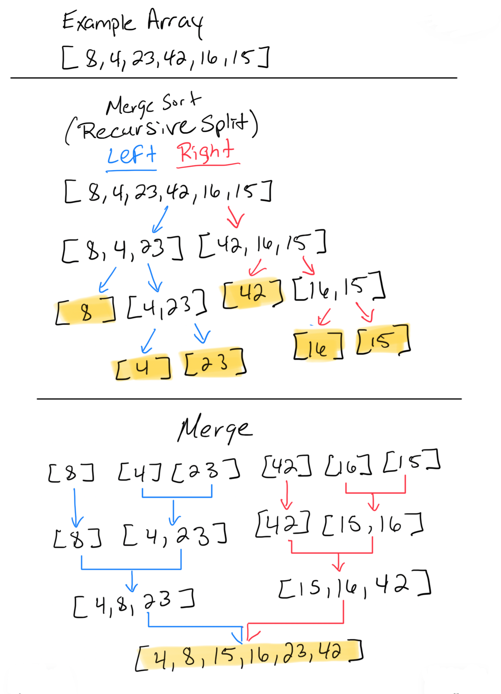

## Efficiency

### Time Complexity - O(n log n)

* Dividing the array into halves (log(n) levels) and merging (n) elements at each level.

### Space Complexity - O(n)

* Need additional space to store the auxiliary arrays used during the merging process.

## Summary

**Divide:** The array is recursively split into smaller sub-arrays until each sub-array has one element.

**Merge:** The merge function is where the sorting happens. It combines two sorted sub-arrays into one sorted array by comparing the elements and placing them in the correct order.

The sorting is performed during the merge step when elements from the two halves are compared and ordered. This ensures that each merge operation results in a sorted array.
