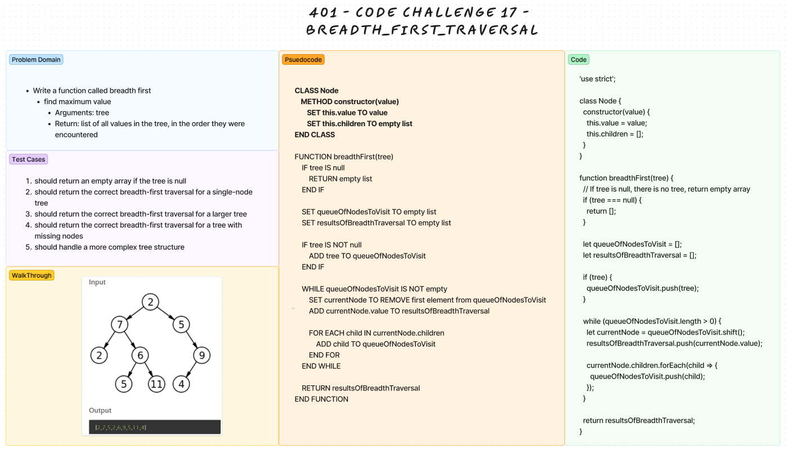

# Code Challenge 17 - Breadth-First Function

## Breadth First Function

* Write a function called breadth first
* Arguments: tree
* Returns: list of all values in the tree, in the order they were encountered

### Whiteboard process Binary Tree

;

### Big O - breadthFirst()

**Time Complexity - O(n):**
Overall, the dominant factor in the time complexity is the processing of each node and adding its children to the queue. Since each node is visited once, and its children are enqueued once, the overall time complexity is O(n).

**Space Complexity - O(n):**
Overall the space complexity is dominated by the space needed for the queue and the results list, which gives a space complexity of O(n).
