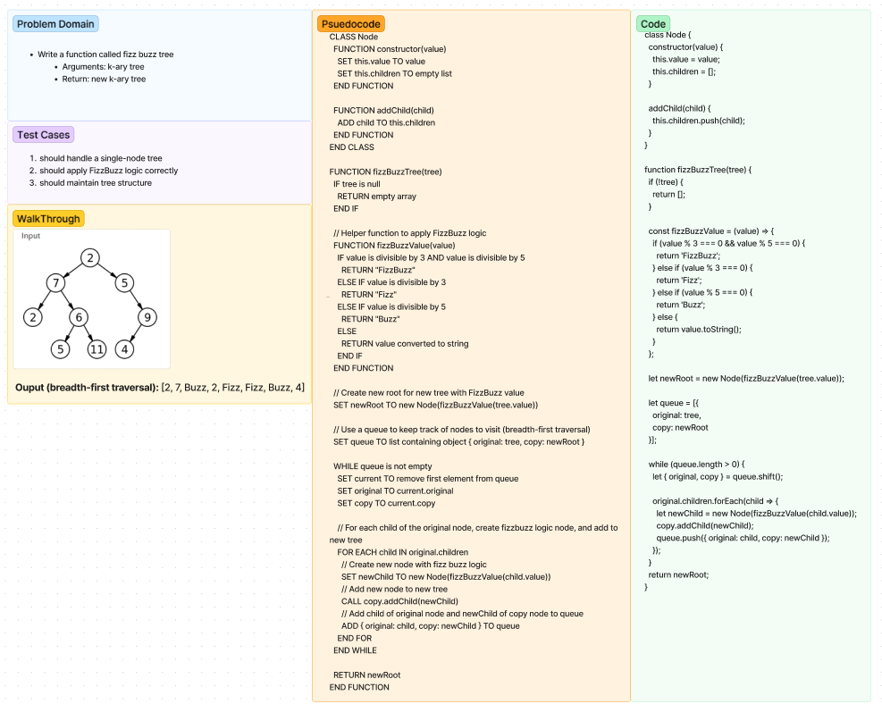

# Code Challenge 17 - Breadth-First Function

## Fizz Buzz tree Function

* Write a function called fizz buzz tree
* Arguments: k-ary tree
* Return: new k-ary tree

### Whiteboard process Binary Tree

;

### Big O - fizzBuzzTree()

**Time Complexity - O(n):**
Overall, the dominant factor in the time complexity is the copying of each node and adding its children to the queue. Since each node is visited once, and its children are enqueued once, the overall time complexity is O(n)

**Space Complexity - O(n):**
Overall, the space complexity is dominated by the space needed for the queue and the new tree's nodes, which gives a space complexity of O(n).
